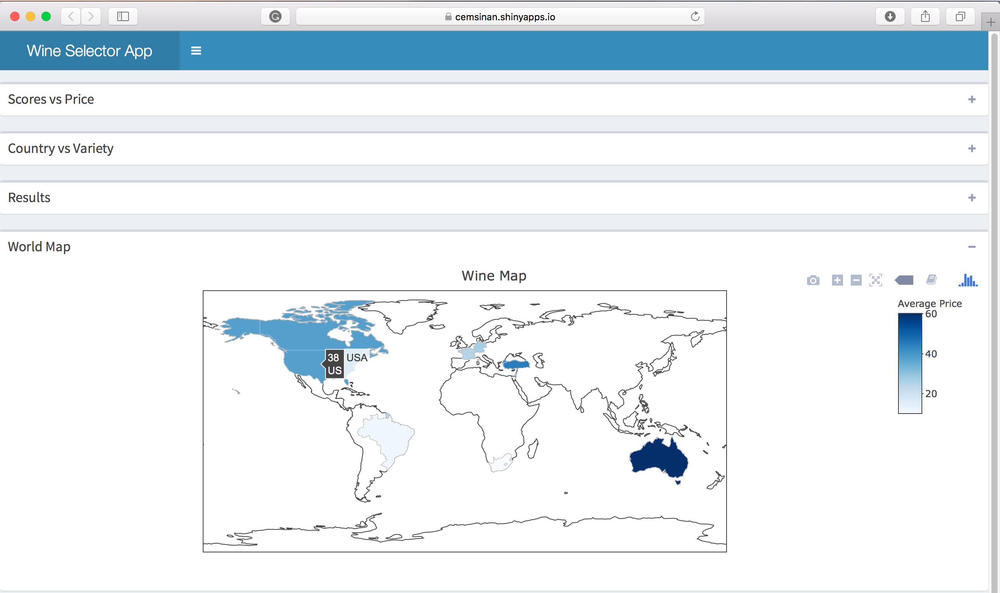

**Project:** WineSelectorApp

**Created by:** Cem Sinan Ozturk

**Date Created:** 2018-01-20

## Shiny App can be found on :

[https://cemsinan.shinyapps.io/WineSelectorApp/](https://cemsinan.shinyapps.io/WineSelectorApp/)

## Overview of App:

Do you remember how many times you felt disappointed with your wine selection? In order to achieve this, you may need a good guide while deciding to select the wine. My app can help to find the best wine in a short time according to many tasters’ experience/reviews and user’s criteria, which are taster name, price range, country, score range and variety, the user can also extend or narrow the filters as she wishes.

## Data: 
The dataset has been taken from [Kaggle Wine Reviews Data](https://www.kaggle.com/zynicide/wine-reviews/data). This dataset has 130k wine entries. Each wine has 13 interrelated variables, which give more details about the wine; `country`, `province`, `region_1`, `region_2`, `description`, `designation`, `title`, `price`, `variety` and `winery` variables are for general information about wine, `points` is the variable for taster review’s on Twitter, on the scale of 100 and finally `taster_name` and `taster_twitter_handle` are variables for taster name and their Twitter account information.

## App Appearance:

